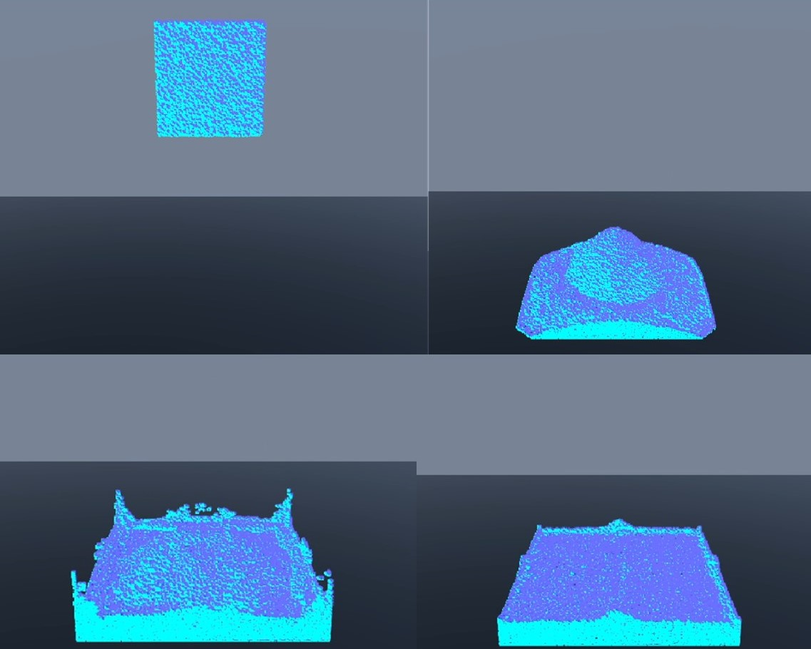
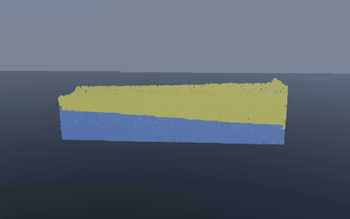
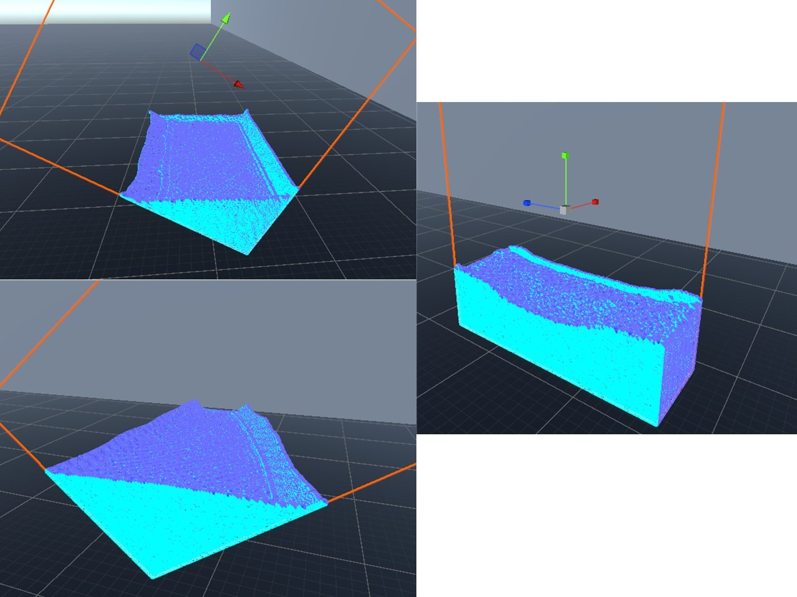

#  Real-Time Multi-Phase Fluid Simulation
*A GPU-accelerated fluid simulation using Smoothed Particle Hydrodynamics (SPH) in Unity.*

---

##  Project Overview

This project implements a real-time SPH-based fluid simulation capable of modelling **multi-phase fluids** (e.g. oil and water) using compute shaders in Unity. It balances **computational efficiency** with **visual realism**, targeting interactive applications like games and virtual environments.

> Built as part of the Honours Dissertation for the BSc (Hons) Games Development at Edinburgh Napier University.

---

## Features

-  Multi-phase SPH simulation (supports multiple fluid types with unique properties)
-  Surface tension and interfacial dynamics
-  GPU compute shader acceleration for real-time performance
-  Particle boundary collision and object interaction
-  Real-time visualisation with Unity shaders
-  Modular particle spawners

---

##  Getting Started

1. Clone or download this repository.
2. Open in **Unity 2022.3 LTS** or later.
3. Add `SPH.cs` to a GameObject in the scene.
4. Add one or more `SpawnBox` components to define fluid sources.
5. Attach a boundary cube (or use fallback bounds).
6. Assign a material to the SPH renderer and hit *Play*.

---

## 🛠Configuration

| Setting                  | File         | Description                                        |
|--------------------------|--------------|----------------------------------------------------|
| Particle Count           | `SpawnBox.cs`| Number of particles per volume                     |
| SPH Physics Parameters   | `SPH.cs`     | Viscosity, density, surface tension, etc.          |
| Grid Resolution          | `SPH.cs`     | Controls spatial partitioning resolution           |
| Collision & Boundaries   | `SPH.cs`     | Set obstacle colliders and simulation limits       |

---

## Screenshots

### Multi-phase Interaction  

### Boundary Interactions  

### Object Interactions  

---

## Known Limitations

-  High particle counts (>200k) may reduce performance on older GPUs.
-  Surface tension threshold requires tuning to avoid instability.
-  Rotating boundaries are supported but may require manual adjustment.

---

If you're interested in the theoretical background and implementation details here is my Paper on the project [View Dissertation Report (PDF)](readme_files/Dissertation-CameronPearson-40530119.pdf)

---

##  Author

**Cameron Pearson**  
BSc (Hons) Games Development

